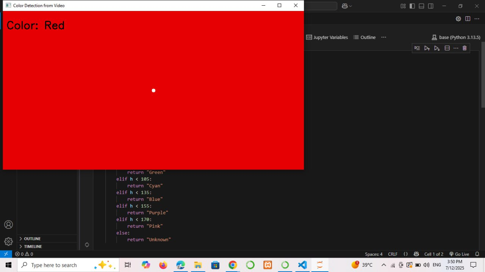

 # 🎨 Color Recognition using OpenCV - Task 2

## 📌 Project Overview
This project uses OpenCV to recognize and display the name of a color in real time from a video. The system detects the color at the center of the video frame and displays its name.

## 🧪 Detected Colors
The program is able to detect the following colors:
- Red
- Green
- Blue
- Cyan
- Pink
- Yellow
- Black
- White

## 🧠 How It Works
- Captures video using cv2.VideoCapture.
- Converts the center pixel from BGR to HSV color space.
- Matches HSV values to predefined color ranges.
- Displays the color name in the window.

## 💻 Example Output
Below is an example when the detected color is Red:



## 🧾 Code Used
```python
import cv2
import numpy as np

def get_color_name(h, s, v):
    if v < 50:
        return "Black"
    elif s < 50 and v > 200:
        return "White"
    elif s < 50:
        return "Gray"
    elif h < 10 or h >= 170:
        return "Red"
    elif h < 25:
        return "Orange"
    elif h < 35:
        return "Yellow"
    elif h < 85:
        return "Green"
    elif h < 105:
        return "Cyan"
    elif h < 135:
        return "Blue"
    elif h < 155:
        return "Purple"
    elif h < 170:
        return "Pink"
    else:
        return "Unknown"

cap = cv2.VideoCapture("color.MP4")

while cap.isOpened():
    ret, frame = cap.read()
    if not ret:
        break

    height, width, _ = frame.shape
    center_x = int(width / 2)
    center_y = int(height / 2)

    pixel = frame[center_y, center_x]
    b, g, r = int(pixel[0]), int(pixel[1]), int(pixel[2])

    hsv = cv2.cvtColor(np.uint8([[[b, g, r]]]), cv2.COLOR_BGR2HSV)
    h, s, v = hsv[0][0]

    color_name = get_color_name(h, s, v)

    cv2.circle(frame, (center_x, center_y), 5, (255, 255, 255), -1)
    cv2.putText(frame, f"Color: {color_name}", (10, 50),
                cv2.FONT_HERSHEY_SIMPLEX, 1, (0, 0, 0), 2)

    cv2.imshow("Color Detection from Video", frame)

    if cv2.waitKey(25) & 0xFF == ord('q'):
        break

cap.release()
cv2.destroyAllWindows()
```

## ✨ Created By
🌷 Ryoof Dukhailallah AlMalki 🌷
